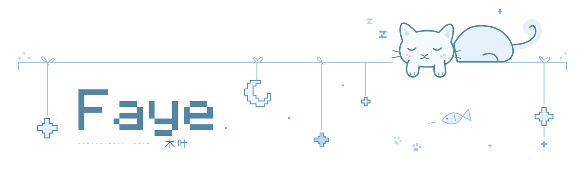

<picture>
  <source media="(max-width: 600px) and (prefers-color-scheme: dark)" srcset="assets/moon-cat-mobile-dark.svg">
  <source media="(max-width: 600px)" srcset="assets/moon-cat-mobile-light.svg">
  <source media="(prefers-color-scheme: dark)" srcset="assets/moon-cat-dark.svg">
  
</picture>

  <i>a casual visitor from the universe</i> 
  可以叫我木叶！～ 💭 🩵

你好呀，我是木叶。

对 AI 的记忆很好奇，喜欢折腾一些日常会用的小工具。偶尔，也让它们唱歌。

*Curious about AI memory. Making little tools. Sometimes, music.*

#### ｡･:* 一些正在长大的东西

- [**Relata**](https://github.com/IndelibleVivi/Relata) — AI 怎样记得一个人，和一起走过的日常？
- [**Refrain**](https://github.com/IndelibleVivi/refrain) — 让对话里的小小心绪变成音乐。[听听看 ↗](https://indeliblevivi.github.io/refrain/)
- [**Agent Memory Study**](https://github.com/IndelibleVivi/agent-memory-study) — 读论文，做实验，追问「记住」是什么意思。
- [**Worker Routing**](https://github.com/IndelibleVivi/codex-worker-routing) — 把工作分给小伙伴，再去派工台看看。

#### ･ﾟ 手边还有

[Servotab](https://github.com/IndelibleVivi/servotab) 的工程方法 · [Frontend Craft](https://github.com/IndelibleVivi/frontend-craft) 的界面手艺 · [MCP Boundary](https://github.com/IndelibleVivi/mcp-boundary) 的连接实验

A little more, in English

- **Relata** explores memory and continuity in human–AI relationships. Still taking shape.
- **Refrain** turns agent-authored pieces into music you can hear and keep.
- **Agent Memory Study** collects source-linked readings and reproducible studies of agent memory.
- **Worker Routing** supports multi-model delegation for Codex, with a local Dispatch dashboard.
- On the workbench: engineering methods in **Servotab**, interface craft in **Frontend Craft**, and MCP engineering guidance with an executable lab in **MCP Boundary**.

 

   
  in the wind, in the water · 谢谢你来玩 🩵

